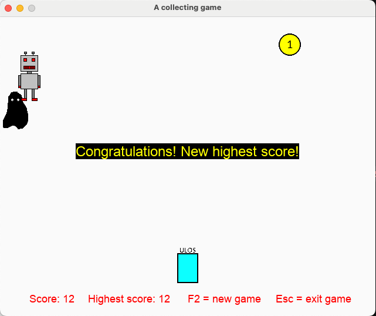

# A Collecting Game

A simple collecting and survival game made with Python and Pygame.

The player controls a robot that collects coins while avoiding a monster wandering around the map. The goal is to collect as many coins as possible before getting caught. The game also tracks the highest score.

## Features

- Move the robot in 4 directions
- Random coin spawning
- Random monster movement
- Score and highest score tracking
- Restart game with `F2`
- Exit game with `ESC`
- Collision detection
- Simple class-based game structure

## Controls

- `← ↑ ↓ →` : Move robot
- `F2` : Start a new game
- `ESC` : Exit the game

## Requirements

- Python 3
- Pygame

## Installation

Install pygame:

```bash
pip3 install pygame
```

## How to Run

Clone the repository:

```bash
git clone https://github.com/hangkimngo/CollectingGame
```

Go into the project folder:

```bash
cd CollectingGame
```

Run the game:

```bash
python main.py
```

## How the Game Works

- The robot collects coins to increase the score.
- The monster starts moving after a short delay.
- If the monster touches the robot, the game ends.
- The highest score is saved during the program session.

## Code Structure

The project uses classes to separate game logic:

- `CollectingGame` → main game logic and loop
- `Robot` → player movement
- `Monster` → monster movement and behavior
- `Coin` → coin spawning

## Future Improvements

- Add multiple levels
- Add sound effects and music
- Improve monster AI
- Add animations
- Save highest score permanently

## Preview



## Author

Hang Ngo
